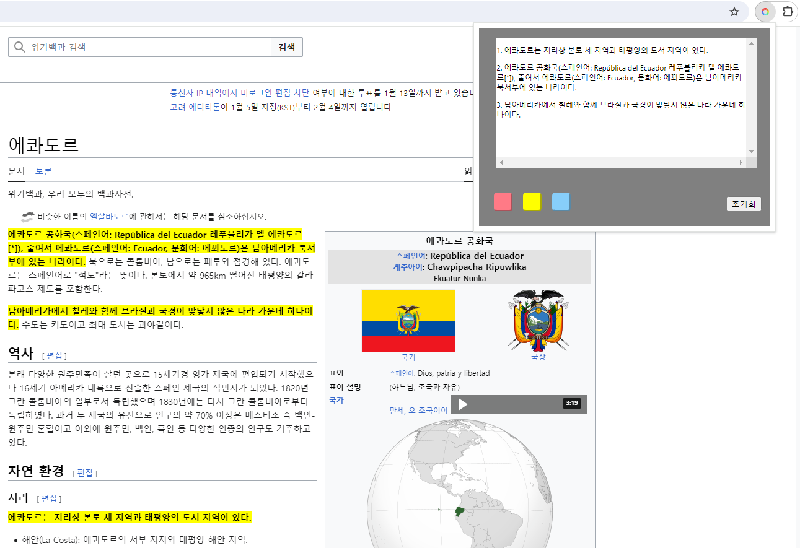

# AiLighter Server
## 개요

- 웹페이지의 중요문장을 NLP기술로 하이라이팅하는 AiLighter 프로젝트의 서버사이드 코드입니다.
- 클라이언트가 HTTP요청으로 보낸 본문에서 중요문장 3문장을 선별하여 응답합니다.
- 클라이언트 코드 : https://github.com/ldw3097/AiLighter

## 실행 방법
- 다음 명령줄로 실행합니다.
`uvicorn src/Ailighter_server:app` 

- 용량문제로 모델파일은 레포지토리에 포함되지 않았기 때문에 실제 구동을 원하시면 아래 항목을 참고하여 직접 pre-trian을 진행하거나 이메일로 문의주세요.

## pre-train 방법
### 필요한 파이썬 패키지
* pyrouge
* pytorch_pretrained_bert
* tensorboardX

### 1. 데이터 다운받기
aihub 문서요약 텍스트를 다운받습니다.
https://www.aihub.or.kr/aihubdata/data/view.do?currMenu=115&topMenu=100&aihubDataSe=realm&dataSetSn=97

### 2. 데이터에 POS 태깅을 한다.
#### 데이터 준비
학습시킬 json 파일을 raw_data 폴더에 넣습니다.
파일명은 아래와같은 형식이어야 합니다. 
korean.train.*.json
korean.valid.*.json
korean.test.*.json

예시: korean.train.news.json

#### 태깅 실행
src 폴더에서 아래 명령어를 실행합니다.
모든 파일 태깅: python article2json.py
한 파일 태깅: python article2json.py {파일 이름}

### 3. POS 태깅된 데이터를 임베딩한다.

    python preprocess.py -mode format_to_bert -raw_path ../pos_data -save_path ../bert_data -vocab_file_path "{etri bert config path}"
    예시: python preprocess.py -mode format_to_bert -raw_path ../pos_data -save_path ../bert_data -vocab_file_path "/home/dongwon/001_bert_morp_pytorch/vocab.korean_morp.list" 

위 코드를 실행하면 bert_data 폴더 밑에 새로운 .pt파일이 생성됩니다.

### 4. 코드를 학습시킨다.
Newsdata_extractive_summ.ipynb를 실행시키면서 코드를 학습시킵니다.
명령어 실행시 경로는 본인에 맞게 변경해주셔야 됩니다.

### 5. 요약을 테스트해본다.
ailighter_summary_test를 실행하여 요약 동작을 테스트해볼수 있습니다.

## 참고문헌
Korbertsum : https://velog.io/@raqoon886/KorBertSum-SummaryBot
POS태깅 관련 : https://velog.io/@shoveling42/KorBertSum
